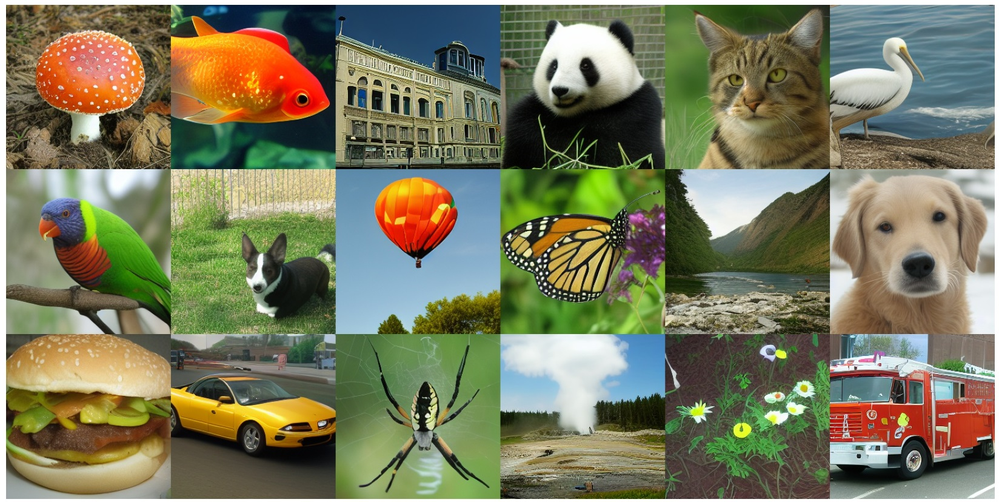

### Latent VAE

Code for the paper [High Fidelity Image Synthesis With Deep VAEs In Latent Space](https://arxiv.org/abs/2303.13714). 
The idea of this work is to do fast and high-fidelity image generation, by using deep VAEs (aka hierarchical VAEs) in a low-dimensional latent space. The core generative component is a hierarchical VAE (see e.g. [VDVAE](https://arxiv.org/abs/2011.10650)), which use a sequence of learned conditional distributions to generate samples. 
Rather than applying the VAE on natural images, we first perform dimensionality reduction, similar to what is done in Stable Diffusion. The importance of this dimensionality reduction is that it alleviates the learning difficulties VAEs normally face when using a per-pixel loss objective. Similar to GANs, and unlike diffusion models, this method uses only one forward pass during generation, meaning it is quite fast.



#### Instructions

First, clone the repo and change directory into it. Then do:
```pip install -r requirements.txt```

Once that is set up, you should be able to sample from our models. The general way to do this is:
```python evaluate.py $dataset --n_sample $n_sample -- n_row $n_row```

which will create a figure of with $n_row images per row, and $n_sample images in total. $dataset specifies which model you want to sample from; the choices are "imagenet", "bedroom", and "church", which correspond to models trained on the ImageNet-256, LSUN Bedroom, and LSUN church datasets respectively. There are additional arguments too, you can look within evaluate.py for more options.

#### Trained Models/Checkpoints

By default, the codebase will automatically download the relevant models if they are not found in a folder ./models. You can also download them on google drive here, and put them in ./models:

ImageNet-256 [link](https://drive.google.com/file/d/1-Td-danBSRX4IhlXAD_CtgFARbu4C9hH/view)
LSUN Bedroom [link](https://drive.google.com/file/d/1--uqW9S8-tbMJG8whHDx1qPJeH5W0j9r/view)
LSUN Church [link](https://drive.google.com/file/d/1-174o5MywJYhhOcYI6yzMfUP5DvnlPcK/view)

#### Acknowledgements

This work was supported by the TPU Research Cloud (TRC) Program from Google, which provided Cloud TPUs used to train the models.
